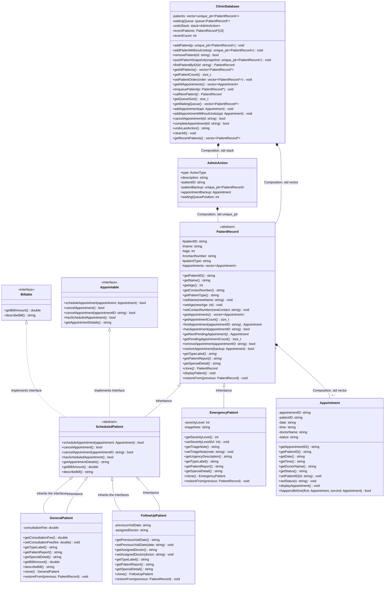

# SCAPMS - Model Layer

```mermaid
classDiagram
    class Appointable {
        <<interface>>
        +scheduleAppointment(appointment: Appointment) bool
        +cancelAppointment() bool
        +cancelAppointment(appointmentID: string) bool
        +hasScheduledAppointment() bool
        +getAppointmentDetails() string
    }

    class Billable {
        <<interface>>
        +getBillAmount() double
        +describeBill() string
    }

    class PatientRecord {
        <<abstract>>
        #patientID: string
        #name: string
        #age: int
        #contactNumber: string
        #patientType: string
        #appointments: vector~Appointment~
        +getPatientID() string
        +getName() string
        +getAge() int
        +getContactNumber() string
        +getPatientType() string
        +setName(newName: string) void
        +setAge(newAge: int) void
        +setContactNumber(newContact: string) void
        +getAppointments() vector~Appointment~
        +getAppointmentCount() size_t
        +findAppointment(appointmentID: string) Appointment
        +hasAppointment(appointmentID: string) bool
        +getNextPendingAppointment() Appointment
        +getPendingAppointmentCount() size_t
        +removeAppointment(appointmentID: string) bool
        +restoreAppointment(backup: Appointment) bool
        +getTypeLabel()* string
        +getPatientReport()* string
        +getSpecialDetail()* string
        +clone()* PatientRecord
        +displayPatient() void
        +restoreFrom(previous: PatientRecord) void
    }

    class ScheduledPatient {
        <<abstract>>
        +scheduleAppointment(appointment: Appointment) bool
        +cancelAppointment() bool
        +cancelAppointment(appointmentID: string) bool
        +hasScheduledAppointment() bool
        +getAppointmentDetails() string
        +getBillAmount() double
        +describeBill() string
    }

    class GeneralPatient {
        -consultationFee: double
        +getConsultationFee() double
        +setConsultationFee(fee: double) void
        +getTypeLabel() string
        +getPatientReport() string
        +getSpecialDetail() string
        +getBillAmount() double
        +describeBill() string
        +clone() GeneralPatient
        +restoreFrom(previous: PatientRecord) void
    }

    class EmergencyPatient {
        -severityLevel: int
        -triageNote: string
        +getSeverityLevel() int
        +setSeverityLevel(lvl: int) void
        +getTriageNote() string
        +setTriageNote(note: string) void
        +getUrgencyDescription() string
        +getTypeLabel() string
        +getPatientReport() string
        +getSpecialDetail() string
        +clone() EmergencyPatient
        +restoreFrom(previous: PatientRecord) void
    }

    class FollowUpPatient {
        -previousVisitDate: string
        -assignedDoctor: string
        +getPreviousVisitDate() string
        +setPreviousVisitDate(date: string) void
        +getAssignedDoctor() string
        +setAssignedDoctor(doctor: string) void
        +getTypeLabel() string
        +getPatientReport() string
        +getSpecialDetail() string
        +clone() FollowUpPatient
        +restoreFrom(previous: PatientRecord) void
    }

    class Appointment {
        -appointmentID: string
        -patientID: string
        -date: string
        -time: string
        -doctorName: string
        -status: string
        +getAppointmentID() string
        +getPatientID() string
        +getDate() string
        +getTime() string
        +getDoctorName() string
        +getStatus() string
        +setPatientID(id: string) void
        +setStatus(s: string) void
        +displayAppointment() void
        +happensBefore(first: Appointment, second: Appointment) bool
    }

    class AdminAction {
        +type: ActionType
        +description: string
        +patientID: string
        +patientBackup: unique_ptr~PatientRecord~
        +appointmentBackup: Appointment
        +waitingQueuePosition: int
    }

    class ClinicDatabase {
        -patients: vector~unique_ptr~PatientRecord~~
        -waitingQueue: queue~PatientRecord*~
        -undoStack: stack~AdminAction~
        -recentPatients: PatientRecord*[10]
        -recentCount: int
        +addPatient(p: unique_ptr~PatientRecord~) void
        +addPatientWithoutUndo(p: unique_ptr~PatientRecord~) void
        +removePatient(id: string) bool
        +pushPatientSnapshot(snapshot: unique_ptr~PatientRecord~) void
        +findPatientByID(id: string) PatientRecord*
        +getAllPatients() vector~PatientRecord*~
        +getPatientCount() size_t
        +setPatientOrder(order: vector~PatientRecord*~) void
        +getAllAppointments() vector~Appointment~
        +enqueuePatient(p: PatientRecord*) void
        +callNextPatient() PatientRecord*
        +getQueueSize() size_t
        +getWaitingQueue() vector~PatientRecord*~
        +addAppointment(apt: Appointment) void
        +addAppointmentWithoutUndo(apt: Appointment) void
        +cancelAppointment(id: string) bool
        +completeAppointment(id: string) bool
        +undoLastAction() string
        +clearAll() void
        +getRecentPatients() vector~PatientRecord*~
    }

    PatientRecord <|-- ScheduledPatient : Inheritance
    ScheduledPatient <|-- GeneralPatient : Inheritance
    PatientRecord <|-- EmergencyPatient : Inheritance
    ScheduledPatient <|-- FollowUpPatient : Inheritance

    Appointable <|.. ScheduledPatient : Implements Interface
    Billable <|.. ScheduledPatient : Implements Interface
    ScheduledPatient <|-- GeneralPatient : inherits the interfaces
    ScheduledPatient <|-- FollowUpPatient : inherits the interfaces

    PatientRecord "1" *-- "0..*" Appointment : Composition, std vector

    ClinicDatabase *-- PatientRecord : Composition, std vector
    ClinicDatabase *-- AdminAction : Composition, std stack
    AdminAction *-- PatientRecord : Composition, std unique_ptr
```