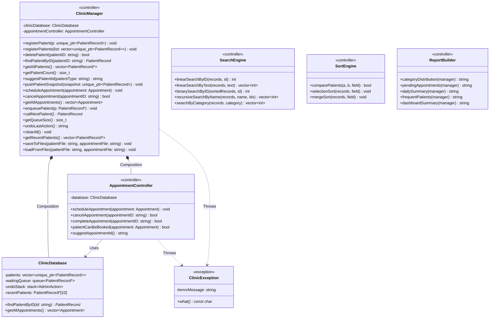

# SCAPMS - Controller Layer

```mermaid
classDiagram
    class ClinicDatabase {
        -patients: vector~unique_ptr~PatientRecord~~
        -waitingQueue: queue~PatientRecord*~
        -undoStack: stack~AdminAction~
        -recentPatients: PatientRecord*[10]
        +findPatientByID(id: string) PatientRecord*
        +getAllAppointments() vector~Appointment~
    }

    class AppointmentController {
        <<controller>>
        -database: ClinicDatabase
        +scheduleAppointment(appointment: Appointment) void
        +cancelAppointment(appointmentID: string) bool
        +completeAppointment(appointmentID: string) bool
        +patientCanBeBooked(appointment: Appointment) bool
        +suggestAppointmentId() string
    }

    class ClinicManager {
        <<controller>>
        -clinicDatabase: ClinicDatabase
        -appointmentController: AppointmentController
        +registerPatient(p: unique_ptr~PatientRecord~) void
        +registerPatients(list: vector~unique_ptr~PatientRecord~~) void
        +deletePatient(patientID: string) bool
        +findPatientByID(patientID: string) PatientRecord*
        +getAllPatients() vector~PatientRecord*~
        +getPatientCount() size_t
        +suggestPatientId(patientType: string) string
        +pushPatientSnapshot(snapshot: unique_ptr~PatientRecord~) void
        +scheduleAppointment(appointment: Appointment) void
        +cancelAppointment(appointmentID: string) bool
        +getAllAppointments() vector~Appointment~
        +enqueuePatient(p: PatientRecord*) void
        +callNextPatient() PatientRecord*
        +getQueueSize() size_t
        +undoLastAction() string
        +clearAll() void
        +getRecentPatients() vector~PatientRecord*~
        +saveToFiles(patientFile: string, appointmentFile: string) void
        +loadFromFiles(patientFile: string, appointmentFile: string) void
    }

    class SearchEngine {
        <<controller>>
        +linearSearchByID(records, id) int
        +linearSearchByText(records, text) vector~int~
        +binarySearchByID(sortedRecords, id) int
        +recursiveSearchByName(records, name, idx) vector~int~
        +searchByCategory(records, category) vector~int~
    }

    class SortEngine {
        <<controller>>
        +comparePatients(a, b, field) bool
        +selectionSort(records, field) void
        +mergeSort(records, field) void
    }

    class ReportBuilder {
        <<controller>>
        +categoryDistribution(manager) string
        +pendingAppointments(manager) string
        +dailySummary(manager) string
        +frequentPatients(manager) string
        +dashboardSummary(manager) string
    }

    class ClinicException {
        <<exception>>
        #errorMessage: string
        +what() const char*
    }

    ClinicManager *-- ClinicDatabase : Composition
    ClinicManager *-- AppointmentController : Composition
    AppointmentController --> ClinicDatabase : Uses
    AppointmentController ..> ClinicException : Throws
    ClinicManager ..> ClinicException : Throws
```