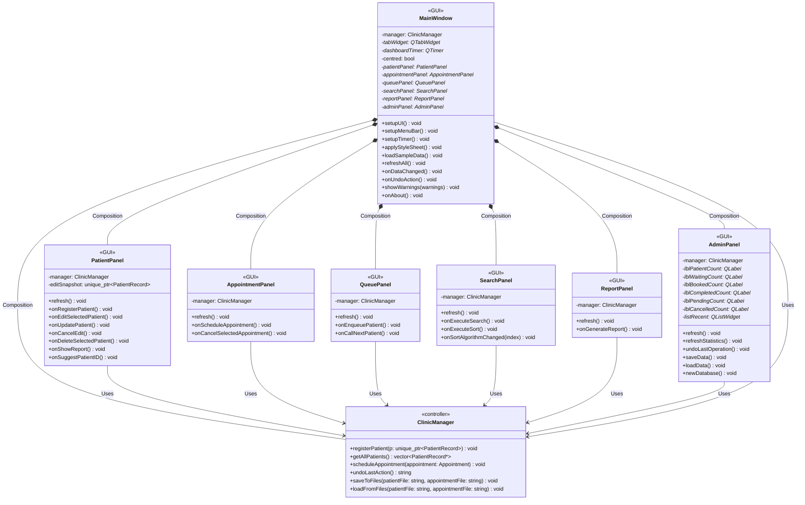

# SCAPMS - GUI Screens

```mermaid
classDiagram
    class ClinicManager {
        <<controller>>
        +registerPatient(p: unique_ptr~PatientRecord~) void
        +getAllPatients() vector~PatientRecord*~
        +scheduleAppointment(appointment: Appointment) void
        +undoLastAction() string
        +saveToFiles(patientFile: string, appointmentFile: string) void
        +loadFromFiles(patientFile: string, appointmentFile: string) void
    }

    class MainWindow {
        <<GUI>>
        -manager: ClinicManager
        -tabWidget: QTabWidget*
        -dashboardTimer: QTimer*
        -centred: bool
        -patientPanel: PatientPanel*
        -appointmentPanel: AppointmentPanel*
        -queuePanel: QueuePanel*
        -searchPanel: SearchPanel*
        -reportPanel: ReportPanel*
        -adminPanel: AdminPanel*
        +setupUI() void
        +setupMenuBar() void
        +setupTimer() void
        +applyStyleSheet() void
        +loadSampleData() void
        +refreshAll() void
        +onDataChanged() void
        +onUndoAction() void
        +showWarnings(warnings) void
        +onAbout() void
    }

    class PatientPanel {
        <<GUI>>
        -manager: ClinicManager
        -editSnapshot: unique_ptr~PatientRecord~
        +refresh() void
        +onRegisterPatient() void
        +onEditSelectedPatient() void
        +onUpdatePatient() void
        +onCancelEdit() void
        +onDeleteSelectedPatient() void
        +onShowReport() void
        +onSuggestPatientID() void
    }

    class AppointmentPanel {
        <<GUI>>
        -manager: ClinicManager
        +refresh() void
        +onScheduleAppointment() void
        +onCancelSelectedAppointment() void
    }

    class QueuePanel {
        <<GUI>>
        -manager: ClinicManager
        +refresh() void
        +onEnqueuePatient() void
        +onCallNextPatient() void
    }

    class SearchPanel {
        <<GUI>>
        -manager: ClinicManager
        +refresh() void
        +onExecuteSearch() void
        +onExecuteSort() void
        +onSortAlgorithmChanged(index) void
    }

    class ReportPanel {
        <<GUI>>
        -manager: ClinicManager
        +refresh() void
        +onGenerateReport() void
    }

    class AdminPanel {
        <<GUI>>
        -manager: ClinicManager
        -lblPatientCount: QLabel*
        -lblWaitingCount: QLabel*
        -lblBookedCount: QLabel*
        -lblCompletedCount: QLabel*
        -lblPendingCount: QLabel*
        -lblCancelledCount: QLabel*
        -listRecent: QListWidget*
        +refresh() void
        +refreshStatistics() void
        +undoLastOperation() void
        +saveData() void
        +loadData() void
        +newDatabase() void
    }

    MainWindow *-- PatientPanel : Composition
    MainWindow *-- AppointmentPanel : Composition
    MainWindow *-- QueuePanel : Composition
    MainWindow *-- SearchPanel : Composition
    MainWindow *-- ReportPanel : Composition
    MainWindow *-- AdminPanel : Composition
    MainWindow *-- ClinicManager : Composition

    PatientPanel --> ClinicManager : Uses
    AppointmentPanel --> ClinicManager : Uses
    QueuePanel --> ClinicManager : Uses
    SearchPanel --> ClinicManager : Uses
    ReportPanel --> ClinicManager : Uses
    AdminPanel --> ClinicManager : Uses
    MainWindow --> ClinicManager : Uses
```