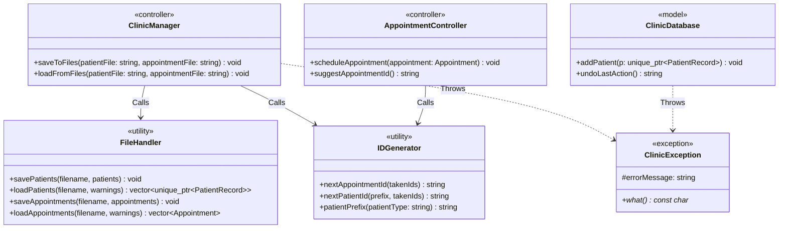

# SCAPMS - Utilities

```mermaid
classDiagram
    class FileHandler {
        <<utility>>
        +savePatients(filename, patients) void
        +loadPatients(filename, warnings) vector~unique_ptr~PatientRecord~~
        +saveAppointments(filename, appointments) void
        +loadAppointments(filename, warnings) vector~Appointment~
    }

    class IDGenerator {
        <<utility>>
        +nextAppointmentId(takenIds) string
        +nextPatientId(prefix, takenIds) string
        +patientPrefix(patientType: string) string
    }

    class ClinicException {
        <<exception>>
        #errorMessage: string
        +what() const char*
    }

    class ClinicManager {
        <<controller>>
        +saveToFiles(patientFile: string, appointmentFile: string) void
        +loadFromFiles(patientFile: string, appointmentFile: string) void
    }

    class AppointmentController {
        <<controller>>
        +scheduleAppointment(appointment: Appointment) void
        +suggestAppointmentId() string
    }

    class ClinicDatabase {
        <<model>>
        +addPatient(p: unique_ptr~PatientRecord~) void
        +undoLastAction() string
    }

    ClinicManager --> FileHandler : Calls
    ClinicManager --> IDGenerator : Calls
    AppointmentController --> IDGenerator : Calls
    ClinicManager ..> ClinicException : Throws
    ClinicDatabase ..> ClinicException : Throws
```